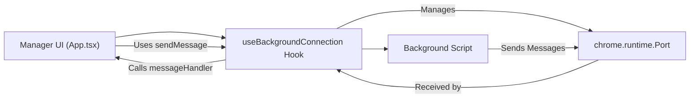

# Background Connection Reconnection Mechanism

This document explains the client-side reconnection logic implemented for maintaining a persistent connection between the Manager UI and the background script in the LazyCluster project.

## Overview

The connection between the Manager UI (`entrypoints/manager/App.tsx`) and the background script is managed through a custom React hook called `useBackgroundConnection`. This hook encapsulates the logic for establishing, maintaining, and automatically reconnecting the communication port to the background script.

## Purpose

- Ensure a stable and persistent connection to the background script.
- Automatically handle disconnections or errors by attempting to reconnect after a delay.
- Provide a clean and reusable interface for sending and receiving messages.

## Implementation Details

### `useBackgroundConnection` Hook

- Located at: `src/hooks/useBackgroundConnection.ts`
- Manages a `chrome.runtime.Port` connection with the background script.
- Automatically attempts to reconnect on disconnect or connection errors with a configurable delay (default 1000ms).
- Exposes:
  - `sendMessage(message)`: Function to send messages to the background script.
  - `isConnected`: Boolean state indicating current connection status.

### Key Features

- Uses React's `useEffect`, `useRef`, and `useCallback` hooks to manage connection lifecycle and message handling.
- Maintains the latest message handler reference to ensure up-to-date processing of incoming messages.
- Handles cleanup on component unmount to avoid memory leaks.
- Logs connection attempts, successes, failures, and disconnections for easier debugging.

## Usage in Manager UI

- The Manager component (`entrypoints/manager/App.tsx`) imports and uses `useBackgroundConnection`.
- It provides a message handler callback to process incoming messages from the background script.
- Sends a `REQUEST_INITIAL_DATA` message once the connection is established to fetch initial tab data.
- Reacts to connection status changes to manage UI state or trigger actions accordingly.

## Communication Flow Diagram

## Benefits

- Improves robustness of the extension by handling transient connection issues transparently.
- Simplifies the Manager UI code by abstracting connection management into a reusable hook.
- Facilitates easier maintenance and future enhancements to the communication layer.

---

_Document created to aid developers in understanding and maintaining the background connection logic in LazyCluster._
