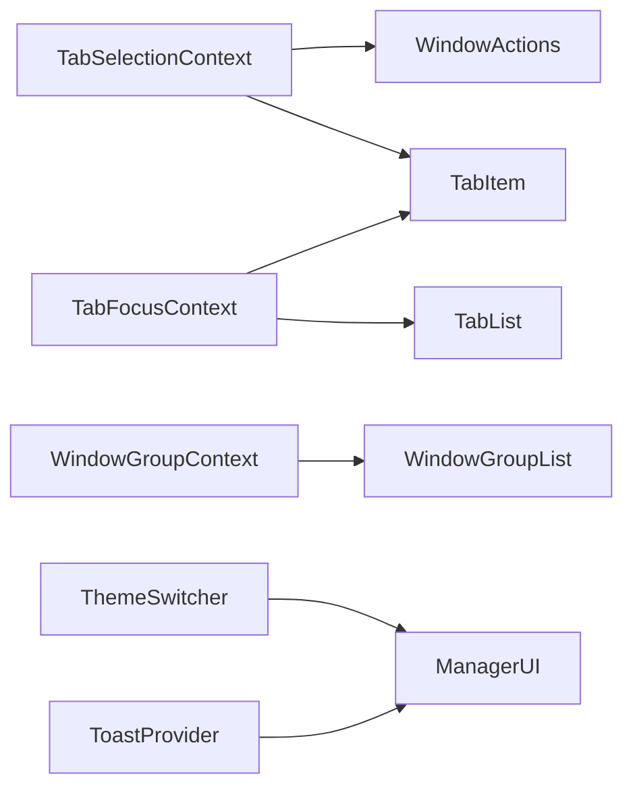
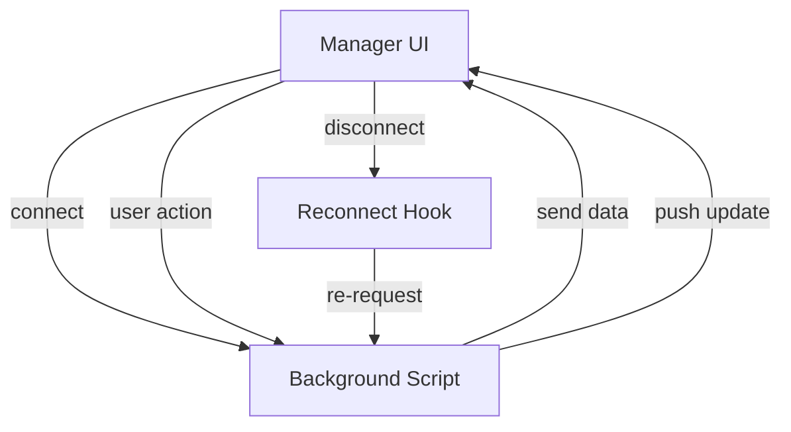

# System Patterns: LazyCluster

## Role

- Describe the system architecture.
- Explain key technical decisions.
- Document design patterns in use.
- Outline component relationships.

## localStorage Key Naming Convention

- Key names follow the order: `appName.pageName.feature`.
- Use dot (`.`) as the main separator for hierarchy levels.
- Use hyphen (`-`) within compound words for clarity.
- Example: `lazycluster.manager.color-scheme`, `lazycluster.manager.theme`.
- This convention improves readability, maintainability, and scalability of stored keys.

## System Architecture

LazyCluster is a modular, event-driven browser extension built with React, TypeScript, and Chrome Extension APIs. The architecture emphasizes component-based design, clear separation of concerns, and robust state management for scalability and maintainability.

### Main Components

#### 1. Manager Tab UI (`entrypoints/manager/App.tsx` and related components)

- **Role:** The primary user interface for managing browser tabs and windows.
- **Key Components:**
  - `Header`: Displays the app title and main controls.
  - `SearchBar`: Filters tabs/windows.
  - `WindowGroupList`: Renders all window groups.
  - `WindowGroup`: Represents a single browser window and its tabs.
  - `WindowHeader`: Shows window-level actions and info.
  - `WindowActions`: Provides actions for all tabs in a window (e.g., select/deselect, close, move).
  - `TabList`: Lists all tabs in a window.
  - `TabItem`: Represents a single tab, with selection and actions.
  - `ThemeSwitcher`: Allows switching between light/dark themes.
  - `Alert`: Shows important messages.
  - `ToastProvider`: Handles toast notifications for errors and feedback.

#### 2. Popup UI (`entrypoints/popup/App.tsx`)

- **Role:** Minimal UI for opening the Manager Tab.
- **Key Components:** Simple button, styled with daisyUI, to launch the main interface.

#### 3. Background Script (`entrypoints/background.ts`)

- **Role:** Core logic and orchestrator.
- **Responsibilities:**
  - Manages Chrome Extension API interactions (tabs, windows, sessions).
  - Handles events from Manager Tab UI and Popup UI.
  - Listens for browser events (tab/window create, remove, update).
  - Maintains persistent connection with Manager Tab UI via `chrome.runtime.Port`.
  - Implements session save/restore, tab/window manipulation, and state updates.

#### 4. Context Providers (`src/contexts/`)

- **TabFocusContext:** Tracks which tab is focused for keyboard navigation.
- **TabGroupContext:** Manages logical groupings of tabs (future extensibility).
- **TabSelectionContext:** Tracks selected tab IDs for bulk actions.
- **WindowGroupContext:** Manages state for window groups and their tabs.

#### 5. Utility Modules

- **`useBackgroundConnection` (hook):** Maintains persistent/reconnecting port to background script.
- **`devLog`:** Development-only logging utility.
- **`backoff`:** Exponential backoff for reconnection attempts.

## Key Design Patterns

- **Component-Based UI:** All UI is built from small, reusable React components, following composition over inheritance.
- **Context-Driven State Management:** React Contexts are used for cross-component state (selection, focus, grouping, etc.), minimizing prop drilling.
- **Event-Driven Architecture:** Communication between UI and background is event/message-based, using persistent ports and short-lived messages as appropriate.
- **Service Worker Pattern:** Background script acts as a long-running service worker, handling all privileged operations and state.
- **Persistent Connection with Auto-Reconnect:** `useBackgroundConnection` ensures the Manager Tab UI always stays in sync with the background, even after background reloads.
- **daisyUI + Tailwind CSS:** All UI styling uses daisyUI 5 and Tailwind CSS 4 utility classes. No custom CSS is written unless absolutely necessary. See `.clinerules/daisyui.md` for rules.
- **Toast Notification Pattern:** All error and feedback messages are surfaced to the user via a global `ToastProvider` component, following ADR-0008.
- **Keyboard Navigation:** Native and custom keyboard navigation for accessibility, as per ADR-0003/0004.
- **Responsive Layouts:** Two-column and column-count layouts for window groups, responsive to screen size (ADR-0002/0006).
- **Development-Only Logging:** `devLog` ensures only critical logs are shown in production.

## Component Relationships

- **Manager UI <-> Background Script:** Persistent connection via `chrome.runtime.Port` managed by `useBackgroundConnection`. All data and commands flow through this channel.
- **Popup UI <-> Background Script:** Uses `chrome.runtime.sendMessage` for one-off actions (open manager tab).
- **TabItem <-> TabSelectionContext:** Each `TabItem` subscribes to selection context to reflect and update selection state.
- **WindowActions <-> TabSelectionContext:** Bulk actions (select all, deselect all, close selected) are coordinated via context.
- **TabFocusContext:** Used by `TabList` and `TabItem` for keyboard navigation and focus management.
- **ToastProvider:** Wraps the entire Manager UI, allowing any component to trigger toast notifications.
- **ThemeSwitcher:** Updates theme state, which is reflected throughout the UI via daisyUI/Tailwind classes.
- **WindowGroupContext:** Provides window/tab state and actions to all window-related components.



## Data Flow

1. **Connection:** Manager Tab UI establishes a persistent port to the background script using `useBackgroundConnection`.
2. **Initial Data Fetch:** On connect, Manager Tab UI requests current tab/window state.
3. **State Update:** Background script fetches data via Chrome APIs and sends it to Manager Tab UI.
4. **Rendering:** Manager Tab UI renders windows/tabs using context and component tree.
5. **User Actions:** User actions (select, close, move, etc.) are dispatched to the background script via the port.
6. **Background Processing:** Background script performs requested actions, updates state, and pushes new data to Manager Tab UI.
7. **Browser Events:** Tab/window changes in the browser trigger background updates, which are pushed to the UI.
8. **Error Handling:** Any errors are surfaced to the user via `ToastProvider`.
9. **Reconnection:** If the port disconnects, `useBackgroundConnection` auto-reconnects and re-requests state.



## Considerations

- **Performance:** Efficient rendering and minimal re-renders are prioritized, especially for large tab/window counts.
- **Scalability:** Modular design and context-driven state allow for easy feature expansion (e.g., tab grouping, advanced search).
- **Maintainability:** Clear separation of UI, state, and background logic. All major decisions are documented in ADRs.
- **Accessibility:** Keyboard navigation and focus management are first-class concerns.
- **Styling Consistency:** All UI uses daisyUI/Tailwind utility classes, following Refactoring UI best practices.
- **Documentation:** All significant changes and patterns are documented in `/ai-docs` and memory-bank files.

---

## React Components

### Avoid Using `React.FC`

When defining React functional components, avoid using `React.FC`. Instead, explicitly type the props and return type.

**Why?**

- `React.FC` implicitly includes `children`, which may not always be desired.
- It can interfere with `defaultProps` and other static properties.
- It's less explicit and can be less readable than typing props directly.

**Instead:**

```typescript
interface MyComponentProps {
  name: string;
}

const MyComponent = ({ name }: MyComponentProps): JSX.Element => {
  return <div>Hello, {name}!</div>;
};
```

**Reference:**

- [TypeScript + React: Why I don't use React.FC](https://fettblog.eu/typescript-react-why-i-dont-use-react-fc/)

**Note:** In this project, define functional components without using React.FC to ensure explicit prop definitions and to avoid unintended inclusion of the children prop.

## Toast and Alert Components Update

- The ToastProvider and Toast components have been restructured to improve compatibility with daisyUI's toast stacking behavior.
- ToastContainer now wraps toasts in a container div with appropriate daisyUI classes to ensure proper stacking.
- The Toast component returns only the content without an extra wrapper div, allowing the container to manage stacking.
- An Alert component was extracted to provide a reusable alert UI, which is used within ToastProvider to display error messages and notifications.
- The ToastProvider injects an `onClose` prop into Alert components to allow for controlled dismissal of toasts.
- TabItem component now uses the Alert component for displaying toast messages on tab close failures.

## References

- `.clinerules/daisyui.md` — daisyUI usage rules
- `.clinerules/project-guidelines.md` — coding, testing, and documentation standards
