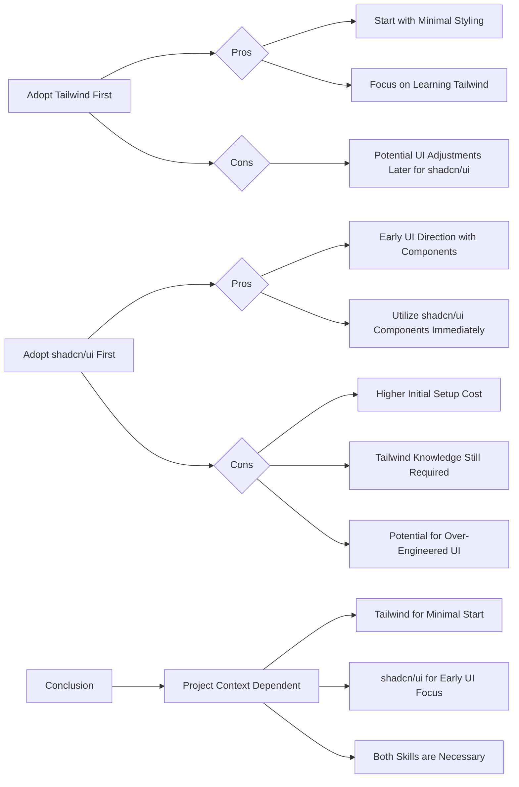

## Tailwind CSS vs. shadcn/ui: Which to Adopt First?

## Role

- Document the decision-making process for choosing between Tailwind CSS and shadcn/ui.
- Outline the pros and cons of each approach.
- Provide recommendations based on project needs and priorities.

When considering styling for a project, a common question arises: Should Tailwind CSS be adopted before shadcn/ui, or vice versa? Let's explore the pros and cons of each approach to help make an informed decision.

### Flowchart of Considerations

### 1. Adopting Tailwind CSS First

**Pros:**

- **Minimal Initial Styling:** You can start with a very basic setup and incrementally add styles as needed. This is ideal for projects that are in the early stages or require a lean approach to styling.
- **Focus on Tailwind CSS Learning Curve:** Since shadcn/ui is built upon Tailwind CSS, learning Tailwind CSS first provides a solid foundation. This makes the subsequent adoption of shadcn/ui smoother and more efficient. You'll better understand how to customize and extend shadcn/ui components.

**Cons:**

- **Potential UI Rework:** When you introduce shadcn/ui later, you might need to refactor existing UI components to align with shadcn/ui's component structure and styling conventions. This could involve some adjustments and potential rework depending on the complexity of your initial UI.

### 2. Adopting shadcn/ui First

**Pros:**

- **Early UI Direction and Consistency:** shadcn/ui provides a set of pre-designed, accessible components. Adopting it early allows you to establish a consistent UI direction from the outset. You can quickly prototype and build interfaces using these components.
- **Rapid UI Development:** Leveraging shadcn/ui components accelerates UI development. You don't have to build everything from scratch, saving time and effort in the initial stages of development.
- **Early Validation of UI Feasibility:** By using shadcn/ui components early, you can quickly assess if shadcn/ui can meet your project's UI requirements. If you encounter limitations, you can identify them sooner and explore alternative solutions.

**Cons:**

- **Higher Initial Setup:** Setting up shadcn/ui might involve a slightly steeper initial learning curve, as it requires some understanding of both Tailwind CSS and shadcn/ui's component structure.
- **Tailwind CSS Knowledge Still Necessary:** While shadcn/ui provides components, customization and deeper understanding often require knowledge of Tailwind CSS. You'll still need to learn Tailwind CSS to effectively customize and extend shadcn/ui components.
- **Risk of Over-Engineering UI:** shadcn/ui offers a rich set of components. There's a potential risk of over-engineering the UI by using more components than necessary, which could lead to unnecessary complexity.

### Conclusion

Ultimately, the best approach depends on your project's specific needs and priorities.

- **Choose Tailwind CSS first if:**

  - You prefer a minimal starting point.
  - Your priority is to deeply learn Tailwind CSS.
  - You anticipate a more iterative UI development process.

- **Choose shadcn/ui first if:**
  - You need to establish a consistent UI quickly.
  - Rapid UI prototyping and development are crucial.
  - You want to validate UI feasibility with pre-built components early on.

**Recommendation:**

Regardless of which path you choose initially, mastering both Tailwind CSS and shadcn/ui is highly beneficial. shadcn/ui enhances Tailwind CSS by providing ready-to-use components, and understanding Tailwind CSS is key to effectively customizing shadcn/ui.

Consider your project's stage, your team's familiarity with Tailwind CSS, and your UI development goals to decide which approach aligns best with your needs.
