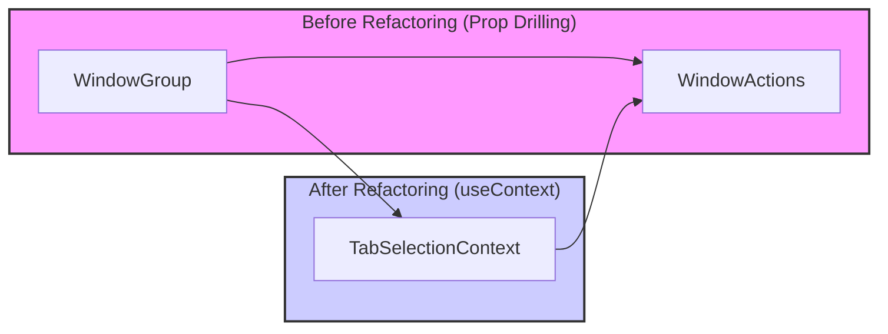

# useContext() Usage: Improving Code Readability by Reducing Prop Drilling

## Background

In the current code, the `isAnyTabCheckedInGroup` prop is being prop-drilled from the `WindowGroup` component to the `WindowActions` component. As the component hierarchy deepens, prop drilling can lead to code that is harder to read and more complex to maintain.

## Improvement Plan

By leveraging the `useContext()` hook from the React Context API, we can eliminate prop drilling and enhance code readability. Specifically, we will extend the `TabSelectionContext` to manage the bulk checkbox state (e.g., `isBulkCheckboxActive`) within the context.

### Implementation Steps

1. **Extend `TabSelectionContext`:**

   Modify `src/contexts/TabSelectionContext.tsx` to include the `isBulkCheckboxActive` state and the `setBulkCheckboxActive` function in the context value. This change allows components to access and update the bulk checkbox state directly without needing to pass props through multiple levels.

   ```typescript
   // Example modification in src/contexts/TabSelectionContext.tsx

   import React, {
     createContext,
     useState,
     useContext,
     PropsWithChildren,
     Dispatch,
     SetStateAction,
     useCallback
   } from 'react';

   interface TabSelectionContextType {
     selectedTabIds: number[];
     setSelectedTabIds: Dispatch<SetStateAction<number[]>>;
     isBulkCheckboxActive: boolean;
     setBulkCheckboxActive: Dispatch<SetStateAction<boolean>>;
     clearSelection: () => void;
     addTabToSelection: (tabId: number) => void;
     removeTabFromSelection: (tabId: number) => void;
     addWindowTabsToSelection: (windowId: number) => void;
     removeWindowTabsFromSelection: (windowId: number) => void;
   }

   const TabSelectionContext = createContext<TabSelectionContextType | undefined>(undefined);

   export const TabSelectionProvider = ({ children }: PropsWithChildren): React.ReactElement => {
     const [selectedTabIds, setSelectedTabIds] = useState<number[]>([]);
     const [isBulkCheckboxActive, setBulkCheckboxActive] = useState<boolean>(false);

     const clearSelection = useCallback(() => {
       setSelectedTabIds([]);
     }, []);

     const addTabToSelection = useCallback((tabId: number) => {
       setSelectedTabIds(prev => [...prev, tabId]);
     }, []);

     const removeTabFromSelection = useCallback((tabId: number) => {
       setSelectedTabIds(prev => prev.filter(id => id !== tabId));
     }, []);

     const addWindowTabsToSelection = useCallback(async (windowId: number) => {
       const tabs = await chrome.tabs.query({ windowId });
       const tabIds = tabs.map(tab => tab.id).filter(id => id !== undefined);
       setSelectedTabIds(prev => [...prev, ...tabIds]);
     }, []);

     const removeWindowTabsFromSelection = useCallback(async (windowId: number) => {
       const tabs = await chrome.tabs.query({ windowId });
       const tabIds = tabs.map(tab => tab.id).filter(id => id !== undefined);
       setSelectedTabIds(prev => prev.filter(id => !tabIds.includes(id!)));
     }, []);

     const value: TabSelectionContextType = {
       selectedTabIds,
       setSelectedTabIds,
       isBulkCheckboxActive,
       setBulkCheckboxActive,
       clearSelection,
       addTabToSelection,
       removeTabFromSelection,
       addWindowTabsToSelection,
       removeWindowTabsFromSelection,
     };

     return (
       <TabSelectionContext.Provider value={value}>
         {children}
       </TabSelectionContext.Provider>
     );
   };

   export const useTabSelectionContext = () => {
     const context = useContext(TabSelectionContext);
     if (!context) {
       throw new Error('useTabSelectionContext must be used within a TabSelectionProvider');
     }
     return context;
   };
   ```

2. **Modify `WindowActions` Component:**

   Update `src/components/WindowActions.tsx` to retrieve the `isBulkCheckboxActive` state and `setBulkCheckboxActive` function directly from `TabSelectionContext` using the `useTabSelectionContext()` hook. Remove the `isAnyTabCheckedInGroup` prop from its props.

   ```typescript
   // Example modification in src/components/WindowActions.tsx

   import { useTabSelectionContext } from '../../src/contexts/TabSelectionContext';

   interface WindowActionsProps {
     windowId: number;
   }

   const WindowActions = ({ windowId }: WindowActionsProps) => {
     const {
       selectedTabIds,
       clearSelection,
       addWindowTabsToSelection,
       removeWindowTabsFromSelection,
       isBulkCheckboxActive,
       setBulkCheckboxActive,
     } = useTabSelectionContext();

     const handleBulkSelectChange = (e: React.ChangeEvent<HTMLInputElement>) => {
       setBulkCheckboxActive(e.target.checked);
       if (e.target.checked) {
         addWindowTabsToSelection(windowId);
       } else {
         removeWindowTabsFromSelection(windowId);
       }
     };

     return (
       <div className="window-actions-container pl-2">
         <input
           id={`bulk-select-tabs-on-window-${windowId}`}
           className="checkbox checkbox-xs"
           type="checkbox"
           onChange={handleBulkSelectChange}
           checked={isBulkCheckboxActive}
         />
         {/* Other action buttons */}
       </div>
     );
   };
   ```

3. **Modify `WindowGroup` Component:**

   Remove the prop for `isAnyTabCheckedInGroup` when rendering `WindowActions` in `src/components/WindowGroup.tsx`, as `WindowActions` now accesses this state from context.

   ```typescript
   // Example modification in src/components/WindowGroup.tsx

   import WindowActions from './WindowActions';

   interface WindowGroupProps {
     // other props...
   }

   const WindowGroup = ({ tabGroup, activeWindowId, handleCloseTab, focusTab }: WindowGroupProps) => {
     // No need to maintain local state for bulk checkbox since it's managed via context

     return (
       <div className="window-group">
         <WindowActions windowId={tabGroup.windowId} />
         <TabList
           tabs={tabGroup.tabs}
           handleCloseTab={handleCloseTab}
           focusTab={focusTab}
           onAnyTabCheckChange={handleAnyTabCheckChange}
         />
       </div>
     );
   };
   ```

4. **No Changes Needed for `TabList` and `TabItem` Components:**

   These components remain unaffected by this refactoring process.

## Summary

By using the Context API and `useContext()`, we eliminate the need for prop drilling between `WindowGroup` and `WindowActions`. This refactoring:

- Simplifies component interfaces.
- Improves code readability and maintainability.
- Enables efficient shared state management across multiple components.



## Benefits

- Eliminates excess prop drilling.
- Simplifies component interfaces.
- Enhances maintainability by centralizing shared state management.
