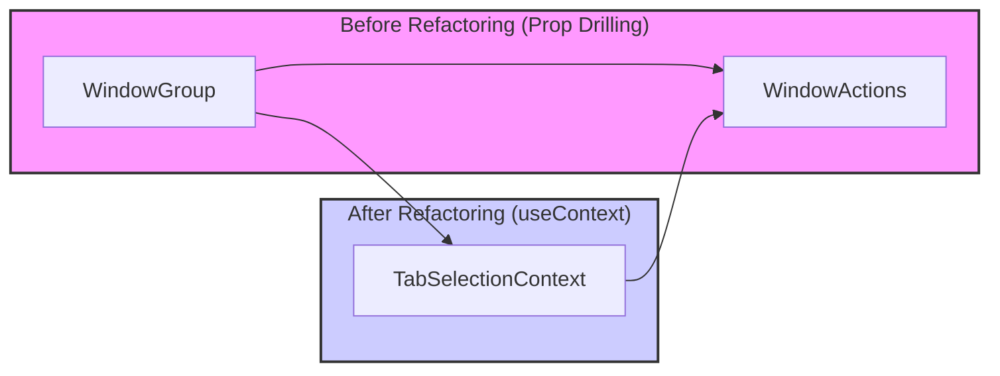

# useContext() Usage: Improving Code Readability by Reducing Prop Drilling

## Background

In the current code, the `isAnyTabCheckedInGroup` prop is being prop-drilled from the `WindowGroup` component to the `WindowActions` component. As the component hierarchy deepens, prop drilling can lead to code that is harder to read and more complex to maintain.

## Improvement Plan

By leveraging the `useContext()` hook from the React Context API, we can eliminate prop drilling and enhance code readability. Specifically, we will extend the `TabSelectionContext` to manage the bulk checkbox state (`isBulkCheckboxActive`, for example) within the context.

### Implementation Steps

1.  **Extend `TabSelectionContext`:**

    Modify `src/contexts/TabSelectionContext.tsx` to include the `isBulkCheckboxActive` state and the `setBulkCheckboxActive` function in the Context Value.

    ```typescript
    // src/contexts/TabSelectionContext.tsx (Example Modification)

    import React, {
      createContext,
      useState,
      useContext,
      PropsWithChildren,
      Dispatch,
      SetStateAction,
    } from 'react';

    interface TabSelectionContextType {
      selectedTabIds: number[];
      setSelectedTabIds: Dispatch<SetStateAction<number[]>>;
      isBulkCheckboxActive: boolean; // Added bulk checkbox state
      setBulkCheckboxActive: Dispatch<SetStateAction<boolean>>; // Added function to update bulk checkbox state
      clearSelection: () => void;
      addTabToSelection: (tabId: number) => void;
      removeTabFromSelection: (tabId: number) => void;
      addWindowTabsToSelection: (windowId: number) => void;
      removeWindowTabsFromSelection: (windowId: number) => void;
    }

    const TabSelectionContext = createContext<TabSelectionContextType | undefined>(undefined);

    export const TabSelectionProvider: React.FC<PropsWithChildren> = ({ children }) => {
      const [selectedTabIds, setSelectedTabIds] = useState<number[]>([]);
      const [isBulkCheckboxActive, setBulkCheckboxActive] = useState<boolean>(false); // Added state to manage bulk checkbox state

      const clearSelection = useCallback(() => {
        setSelectedTabIds([]);
      }, []);

      const addTabToSelection = useCallback((tabId: number) => {
        setSelectedTabIds(prev => [...prev, tabId]);
      }, []);

      const removeTabFromSelection = useCallback((tabId: number) => {
        setSelectedTabIds(prev => prev.filter(id => id !== tabId));
      }, []);

      const addWindowTabsToSelection = useCallback(async (windowId: number) => {
        const tabs = await chrome.tabs.query({ windowId });
        const tabIds = tabs.map(tab => tab.id).filter(isDefined);
        setSelectedTabIds(prev => [...prev, ...tabIds]);
      }, []);

      const removeWindowTabsFromSelection = useCallback(async (windowId: number) => {
        const tabs = await chrome.tabs.query({ windowId });
        const tabIds = tabs.map(tab => tab.id).filter(isDefined);
        setSelectedTabIds(prev => prev.filter(id => !tabIds.includes(id!)));
      }, []);


      const value: TabSelectionContextType = {
        selectedTabIds,
        setSelectedTabIds,
        isBulkCheckboxActive, // Added bulk checkbox state to Context Value
        setBulkCheckboxActive, // Added function to update bulk checkbox state to Context Value
        clearSelection,
        addTabToSelection,
        removeTabFromSelection,
        addWindowTabsToSelection,
        removeWindowTabsFromSelection,
      };

      return (
        <TabSelectionContext.Provider value={value}>
          {children}
        </TabSelectionContext.Provider>
      );
    };

    export const useTabSelectionContext = () => {
      const context = useContext(TabSelectionContext);
      if (!context) {
        throw new Error('useTabSelectionContext must be used within a TabSelectionProvider');
      }
      return context;
    };

    function isDefined<T>(value: T | null | undefined): value is T {
      return value !== null && value !== undefined;
    }
    ```

2.  **Modify `WindowActions` Component:**

    Modify `src/components/WindowActions.tsx` to use `useTabSelectionContext()` to directly access the `isBulkCheckboxActive` state and `setBulkCheckboxActive` function from the `TabSelectionContext`. Remove the `isAnyTabCheckedInGroup` prop.

    ```typescript
    // src/components/WindowActions.tsx (Example Modification)

    import { useTabSelectionContext } from '../../src/contexts/TabSelectionContext';

    interface WindowActionsProps {
      windowId: number;
      // Removed isAnyTabCheckedInGroup prop
    }

    const WindowActions = ({ windowId }: WindowActionsProps) => { // Removed isAnyTabCheckedInGroup prop
      const {
        selectedTabIds,
        clearSelection,
        addWindowTabsToSelection,
        removeWindowTabsFromSelection,
        isBulkCheckboxActive, // Get bulk checkbox state from Context
        setBulkCheckboxActive, // Get function to update bulk checkbox state from Context
      } = useTabSelectionContext();

      ...

      const handleBulkSelectChange = (e: React.ChangeEvent<HTMLInputElement>) => {
        setBulkCheckboxActive(e.target.checked); // Update state in Context
        if (e.target.checked) {
          addWindowTabsToSelection(windowId);
        } else {
          removeWindowTabsFromSelection(windowId);
        }
      };

      ...

      return (
        <div className="window-actions-container pl-2">
          <input
            id={`bulk-select-tabs-on-window-${windowId}`}
            className="checkbox checkbox-xs"
            type="checkbox"
            onChange={handleBulkSelectChange}
            checked={isBulkCheckboxActive} // Use state from Context
          />
          ...
        </div>
      );
    };
    ```

3.  **Modify `WindowGroup` Component:**

    Modify `src/components/WindowGroup.tsx` to remove passing the `isAnyTabCheckedInGroup` prop to the `WindowActions` component.

    ```typescript
    // src/components/WindowGroup.tsx (Example Modification)

    import WindowActions from './WindowActions';

    interface WindowGroupProps {
      ...
    }

    const WindowGroup = ({ tabGroup, activeWindowId, handleCloseTab, focusTab }: WindowGroupProps) => {
      // Removed isAnyTabCheckedInGroup state

      ...

      return (

          ...

            <WindowActions windowId={tabGroup.windowId} /* Removed isAnyTabCheckedInGroup prop */ />
            <TabList
              tabs={tabGroup.tabs}
              handleCloseTab={handleCloseTab}
              focusTab={focusTab}
              onAnyTabCheckChange={handleAnyTabCheckChange}
            />


      );
    };
    ```

4.  **No Changes Needed for `TabList` and `TabItem` Components:**

    These components do not require modifications for this refactoring.

## Summary

By using `useContext()`, we can eliminate Prop Drilling from `WindowGroup` to `WindowActions`, resulting in simpler and more maintainable code. Leveraging the Context API allows for more efficient state sharing between components.


